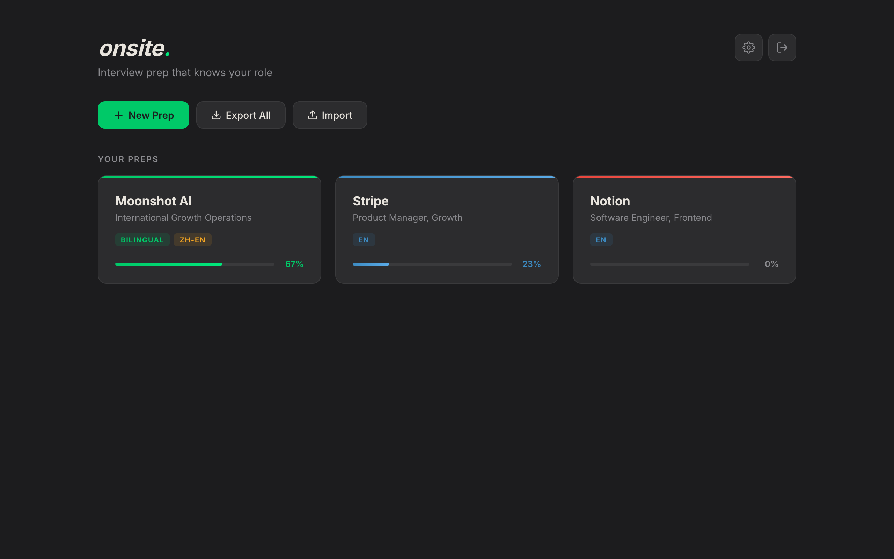
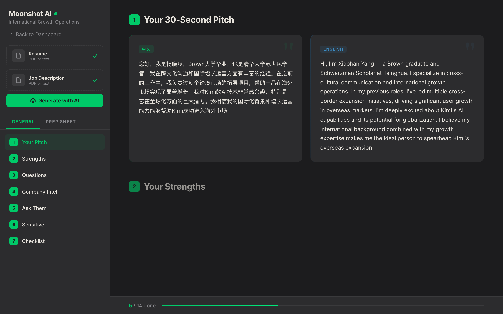
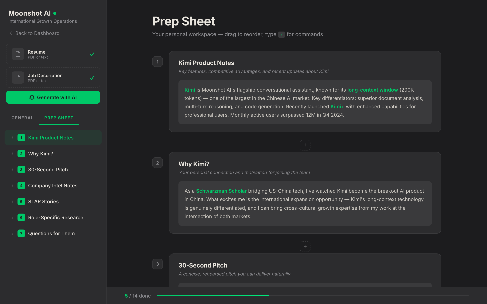
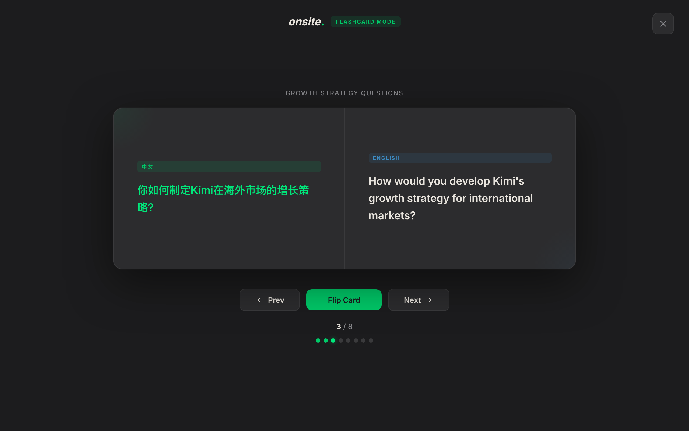

# onsite.

**Interview prep that knows your role.**

Onsite is an AI-powered interview preparation platform that generates tailored prep materials from your resume and job description. It combines role-specific content generation with an interactive, Notion-style workspace — all running client-side for complete privacy.

## Features

### AI-Powered Prep Generation
Upload your resume and job description, choose an AI provider (Claude, OpenAI, DeepSeek, or Kimi), and Onsite generates a complete interview prep kit tailored to the specific role.

### Role-Specific Content
Each prep includes 7 structured sections:
1. **30-Second Pitch** — A polished self-introduction
2. **Strengths & Gaps** — Key strengths with evidence + honest gap analysis
3. **Likely Questions** — Categorized Q&A (role-specific, company knowledge, behavioral)
4. **Company Intel** — Key facts table (founder, valuation, products, competitors)
5. **Questions to Ask** — Smart questions to ask the interviewer
6. **Sensitive Topics** — Scripts for handling tricky questions with do's/don'ts
7. **Prep Checklist** — 3-day prioritized study plan with time estimates

### Bilingual Support
Full Chinese/English mode — every section renders side-by-side in both languages, designed for candidates interviewing across cultures.

### Notion-Style Prep Sheet
A personal workspace with drag-to-reorder cards, slash commands (`/heading`, `/bullet list`, `/quote`, `/divider`), and a floating format bar. Organize your notes, STAR stories, and research however you want.

### Flashcard Practice
Keyboard-driven flashcard mode for rapid review. Supports bilingual cards with Chinese and English displayed side-by-side. Navigate with arrow keys, flip with Space/Enter.

### Progress Tracking
A persistent progress bar tracks checklist completion across your 3-day prep plan, so you always know where you stand.

## Privacy First

- **100% client-side** — all data stays in your browser (localStorage)
- **No backend** — API keys are sent directly to your chosen provider, never to Onsite servers
- **Export/Import** — backup and restore all preps as JSON anytime

## Tech Stack

- Vanilla JavaScript (no frameworks)
- Firebase Auth (Google OAuth)
- Multi-provider AI integration (Claude, OpenAI, DeepSeek, Kimi)
- Responsive dark-mode UI

## Getting Started

1. Open the app and sign in with Google
2. Click **+ New Prep** and enter the company name and role
3. Upload your resume and job description
4. Select an AI provider in Settings and add your API key
5. Hit **Generate with AI** to create your tailored prep kit
6. Edit any section directly — everything auto-saves
7. Use the Prep Sheet tab for free-form notes
8. Practice with flashcards and track your progress with the checklist

## License

MIT
